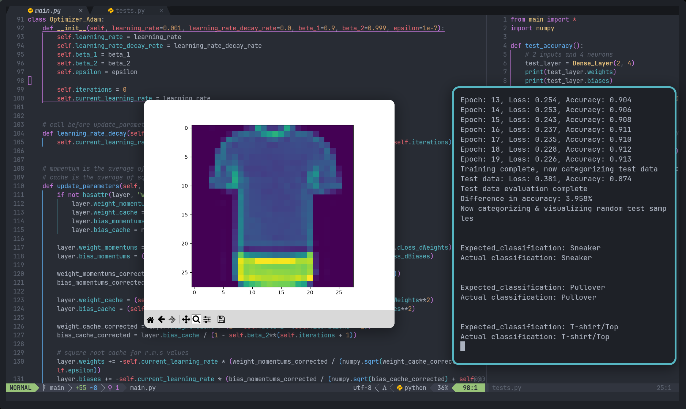

# About #
A neural network learning exercise based on the nnfs.io textbook, trained on the Fashion-MNIST dataset.

Includes dense layers, ReLU, softmax, cross-entropy loss, learning rate decay, and Adam optimizer. 

# Tools #
Python, Numpy
